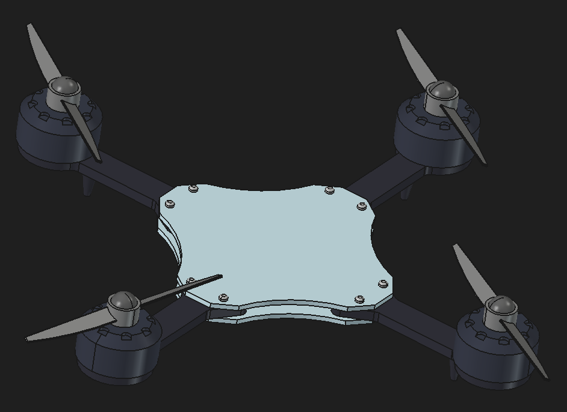

# Quadcopter Drone Frame Assembly

A 3D CAD model of a multi-cylinder internal combustion engine rotating assembly, designed and modeled using FreeCAD.

## Overview
This project features a complete drone assembly consisting of central mounting plates, four cantilevered motor arms, outrunner motors, propellers, structural fasteners, and protective hub covers. It demonstrates proficiency in part modeling, parametric feature creation, and assembly constraints tailored for mechanical engineering and UAV airframe design.

## Demonstration


## Info on Materials & Components
The repository contains the following FreeCAD (`.FCStd`) component and assembly files:
* `Drone-Assembly.FCStd` - Top-level master assembly integrating all components.
* `1.Base.FCStd` - base chassis plate providing structural support for supposed internal electronics.
* `2. Hang.FCStd` - Motor arm extension with mounting points.
* `3. Motor.FCStd` - Brushless electric motor.
* `4. Nut.FCStd` -  Threaded standoff pin used for multi-layer frame assembly.
* `5. Propeller.FCStd` - Dual-blade aerodynamic propeller with central hub mounting hole.
* `6. Cover.FCStd` -  motor nut cover for propellers.

## Engineering Highlights

* **Parametric Modeling:** Components feature fully constrained sketches, revolved features, polar patterns, pads, and pockets for easy geometric tuning.
* **Assembly Constraints:** Utilizes FreeCAD assembly workflows to align motor shafts, arm mounts, plates, and propeller hubs in 3D space.
* **Modular Design:** Symmetrical 4 arm layout balancing structural rigidity, weight distribution, and central electronic payload capacity.

## Software Requirements
* [FreeCAD](https://www.freecad.org/) (Recommended version: 1.0 or newer)

## Usage

* ### Option 1 (local setup)
1. Clone the repository:
   ```bash
   git clone [https://github.com/AnupAdhikari64/crankshaft-piston.Drone-CAD]

2. Open it locally on FreeCAD

* ### Option 2 (View the model online)
*any online viewer can be used, I personally have tested this on [thecadhub.com](https://thecadhub.com/free-tools/freecad-web/)*
1. Head over to [The CAD Hub FreeCAD Web Viewer](https://thecadhub.com/free-tools/freecad-web/).
2. Upload all individual `.FCStd` part files along with `Drone-Assembly.FCStd` simultaneously into the workspace so the assembly can correctly resolve its file links.
